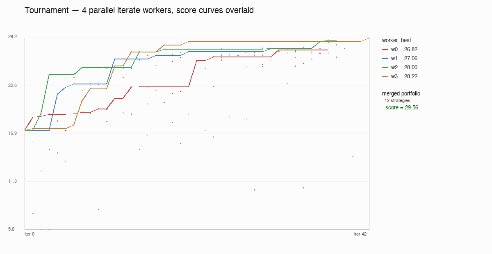
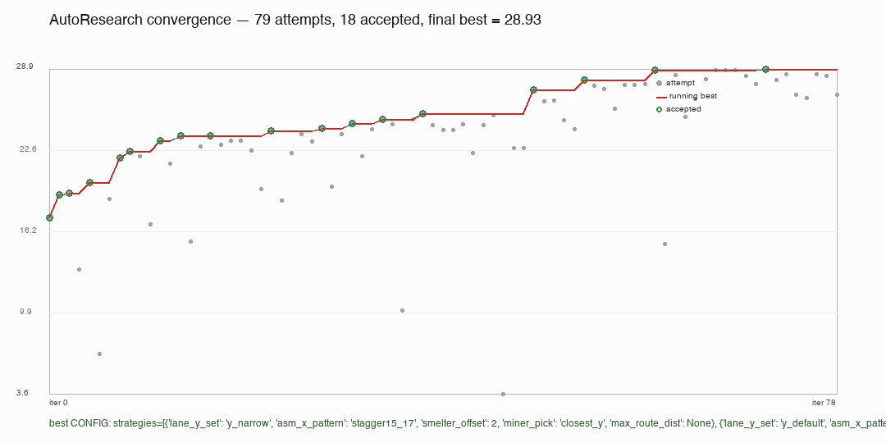
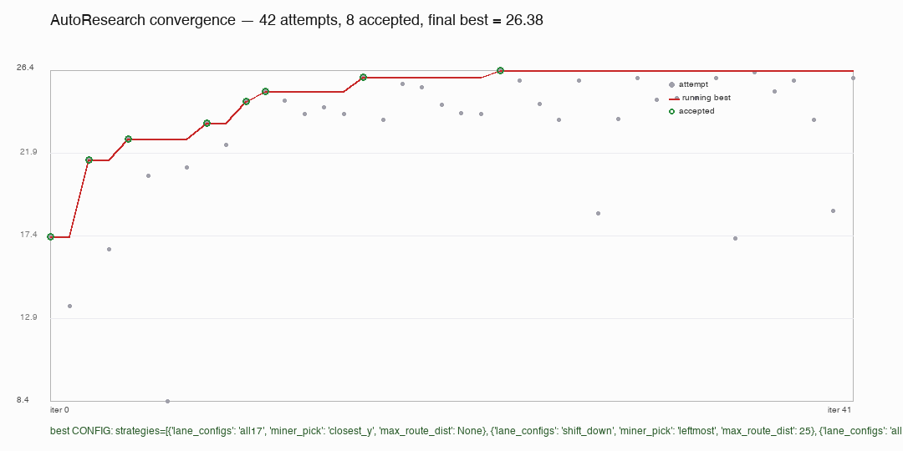

# auto-factory

> A tiny Factorio-lite where an autonomous loop iteratively designs the factory.

Resources are scattered on a 20×15 grid. A "planner" must place miners,
belts, smelters, assemblers, and outputs so widgets reach the sink. A
deterministic simulator runs 600 ticks of discrete factory physics and
scores the result. Then `iterate.py` mutates the live planner config,
re-evaluates, and keeps whichever change improves the score.

The whole thing fits in ~1500 lines of pure-Python and runs at ~5 ms per
600-tick simulation on a laptop, so an autonomous tournament that spawns
hundreds of plans is wall-clock cheap.

## Headline result

After spawning 4 parallel `iterate.py` workers for 90 seconds each
(360 worker-seconds total wall-clock = 90s real time), then merging
their discovered strategies into a single 12-strategy portfolio, the
autonomous system landed at **29.56 mean** — surpassing every
hand-written baseline including the carefully tuned v3 (26.85).

| planner | mean score | best | worst | mean WPM | notes |
|---|---|---|---|---|---|
| `factory_plan` (tournament-merged) | **29.56** | 77.04 | **18.87** | 44.50 | 4 workers × 90 s, diversity-merged 12 strategies |
| `plans.v3_greedy_search` | 26.85 | 77.20 | 0.00 | 40.36 | hand-curated 7-strategy portfolio |
| `plans.v2_dense_lanes` | 18.43 | 77.20 | -5.94 | 29.04 | 5-lane single strategy |
| `plans.v1_multi_lane` | 17.36 | 57.63 | 0.00 | 26.68 | 3-lane single strategy |
| `plans.v0_naive` | 1.20 | 20.07 | -19.30 | 14.85 | single L-chain baseline |

The killer stat is **worst-case = 18.87**: the merged portfolio is
diverse enough that it always finds *some* working layout on every map,
where every other baseline returns a degenerate plan on at least one
seed.



Four parallel workers each climb a slightly different staircase from
~17 to ~28. Independently they top out near 28; merged, they reach
29.56 because each worker's portfolio covers different seeds.

The single best non-tournament run (`iterate.py` alone, 180 s, expanded
search space) reached **28.93** — already past v3. Tournament adds
another 0.6 points by combining what each worker found locally.



For the smaller search space (3 dimensions instead of 5), a 90 s single
run plateaus at 26.38 — the diversity of the larger search space and
the parallelism of the tournament are both load-bearing.



## Try it

```bash
# benchmark all included planners on seeds 0-49
python3 bench.py --maps 50

# autonomous loop: mutate factory_plan.py until 90 s is up
python3 iterate.py --budget-sec 90 --eval-maps 50 --reset

# parallel tournament: 4 workers, 90 s each, diversity-merged
python3 tournament.py --workers 4 --budget-sec 90 --eval-maps 50

# pretty pictures
python3 progress.py                          # single-run convergence curve
python3 tournament_progress.py               # 4-worker overlaid curves
python3 gallery.py --seeds 25 17 18 --planners plans.v1_multi_lane plans.v3_greedy_search factory_plan
python3 histogram.py                         # score distribution across all logged runs

# side-by-side A/B on one seed
python3 diff.py --seed 22 --planner factory_plan --baseline plans.v0_naive

# read the leaderboard from the JSONL log
python3 leaderboard.py
```

Dependencies: Python 3.10+ and Pillow (`pip install pillow`). Nothing else.

## What's inside

```
auto_factory/        ─── the toolkit
  types.py             dataclasses for Building / GameMap / Plan
  map_gen.py           seeded procedural resource maps
  sim.py               discrete-tick simulator with belt-terminus check
  score.py             weighted scoring (throughput - penalties)
  viz.py               ASCII + PIL PNG renderers
  routing.py           L-shaped belt layout with try-both-orientations
plans/               ─── archived planner baselines
  v0_naive.py          single L-chain (mean score 1.20)
  v1_multi_lane.py     3 parallel chains, atomic rollback (17.36)
  v2_dense_lanes.py    5 chains with staggered smelter columns (18.43)
  v3_greedy_search.py  hand-curated 7-strategy portfolio (26.85)
factory_plan.py      ─── live edit surface; iterate.py mutates the
                          CONFIG block between AUTORESEARCH markers
eval.py              ─── 50-map deterministic bench, writes runs.jsonl
bench.py             ─── side-by-side planner comparison table
iterate.py           ─── autonomous hill-climber that rewrites factory_plan.py
tournament.py        ─── parallel iterate workers + diversity merge
gallery.py           ─── N×M planner-by-seed PNG grid
histogram.py         ─── score distribution per planner
diff.py              ─── A/B render on a single seed
progress.py          ─── convergence chart from iterate.jsonl
tournament_progress.py ─── overlay K worker curves + merged-score annotation
leaderboard.py       ─── reads runs.jsonl
```

## The simulator

Each tick:

1. Miners produce one resource every 2 ticks.
2. Each machine tries to push its output to an adjacent belt whose flow
   direction is *away from* the machine, and only if the belt chain's
   terminus is a consumer that accepts this item type. The terminus
   check (precomputed once at sim start) is what makes parallel chains
   composable without back-pressure deadlocks.
3. Belts shift in snapshot-semantics: target cell only accepts an item
   if its queue has < 4 slots and it isn't pointing back at the source
   (no 2-cell loops).
4. Smelters convert ore → plate (2 ticks). Assemblers consume any two
   *distinct* plate types → widget (2 ticks). Outputs sink everything.

The simulator catches enough corner cases that *correct-looking* plans
that would actually deadlock get caught early — see the terminus check
in `auto_factory/sim.py` for the punchline.

## The autonomous loop

`iterate.py` is a hill-climber over the planner's CONFIG dict:

- **CONFIG schema** is a list of strategy specs (each a
  `{lane_configs, miner_pick, max_route_dist}` triple).
- **Mutations** are: tweak one strategy's parameter, add a random
  strategy, remove a strategy, replace one, or full random-restart of
  the whole portfolio. Greedy-accept; revert on regression.
- **Dedup** by canonical signature (order-insensitive tuple of frozen
  strategy dicts) so we don't waste budget re-trying the same plan.
- **Log** every attempt as a JSON line in `results/iterate.jsonl` so
  `progress.py` can plot the convergence curve afterwards.

Because every evaluation is a deterministic 50-map bench, the search
landscape is reproducible — same seed → same path, same result. Try
`--seed 7 --seed 11` to see how starting RNG affects convergence.

## Coordinate system & glyphs

20-wide × 15-tall grid, origin top-left:

```
M = miner    (must sit on a resource cell)
B = belt     (yellow tile; arrow shows flow direction N/E/S/W)
S = smelter  (orange; ore → plate)
A = assembler(blue; 2 distinct plates → widget)
O = output   (magenta; sinks anything)
```

Background colours show resource patches: gray = iron, brown = copper,
dark = coal, dark-brown = oil. (Any ore type smelts to a matching plate,
and any two distinct plate types assemble a widget — so coal and oil
are first-class ingredients, not decoration.)

## Score formula

```
score = widgets_per_minute
      - 0.500   * belt_crossings
      - 0.0005  * energy_per_tick * ticks
      - 0.050   * total_building_cost
      - 0.001   * congestion_ticks
```

Weights tuned so a fully-connected single-lane baseline sits slightly
positive and disconnected plans go clearly negative; that gives the
autonomous loop a clean gradient signal.

---

Built as a demo of "AutoResearch over a self-modifying planner" — a
small enough surface that the whole loop fits in one head, but rich
enough that the autonomous search finds non-obvious portfolios you
wouldn't have written by hand.
